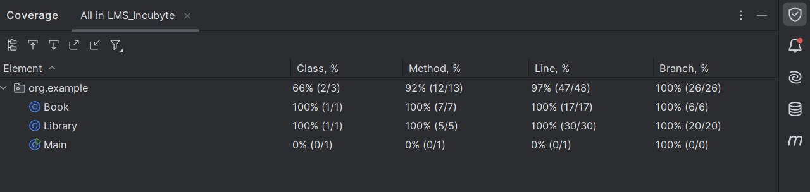

# Library Management System

## Objective

This project is a simple Library Management System that allows users to perform basic operations such as adding books, borrowing books, returning books, and viewing available books. The project is implemented using Java, with a focus on clean code, TDD (Test-Driven Development), and proper usage of Git for version control.

## Table of Contents
1. [Objective](#objective)
2. [Technologies Used](#technologies-used)
3. [Requirements](#requirements)
4. [Installation Process](#installation-process)
5. [Development Guidelines](#development-guidelines)
6. [Running Tests](#running-tests)
7. [Features](#features)
8. [Project Structure](#project-structure)
9. [Key Test Cases](#key-test-cases)
   - [LibraryTest](#librarytest)
   - [BookTest](#booktest)
10. [Notes](#notes)
11. [Test Coverage](#test-coverage)

## Technologies Used

- **Programming Language:** Java
- **Testing Framework:** JUnit 5
- **Build Tool:** Maven
- **Version Control:** Git

## Requirements

- **Java JDK:** Make sure you have Java Development Kit (JDK) installed on your system.
- **JUnit 5:** Ensure JUnit 5 is set up for running the tests.
- **IDE:** You can use any IDE like IntelliJ IDEA, Eclipse, or VS Code for development.

## Installation Process

Follow these steps to set up the Library Management System on your local machine:

1. **Clone the Repository:**
   ```bash
   git clone https://github.com/Vishal-Piprotar/library-management-system.git
   cd library-management-system

   ```
2. Install Java JDK: Make sure you have Java Development Kit (JDK) installed. Download it from the Oracle website or use your system's package manager

```bash
java -version

```

3. Install Maven: Download and install Maven from the official website or use your system's package manager.
```bash
mvn -version

```
4. Set Up JUnit 5: Ensure JUnit 5 is included in the pom.xml file under the <dependencies> section:

```bash 
<dependency>
    <groupId>org.junit.jupiter</groupId>
    <artifactId>junit-jupiter-engine</artifactId>
    <version>5.9.2</version>
    <scope>test</scope>
</dependency>

```

5. Import Project into Your IDE:

```
  ### IntelliJ IDEA

  1. Open IntelliJ IDEA and navigate to `File` > `New` > `Project from Existing Sources...`
  2. Select the `library-management-system` folder from your local machine.
  3. Choose "Import project from external model" and select `Maven`.
  4. Click `Next` and follow the prompts to complete the import process.
```
6. Build the Project:
```bash
mvn clean install
```

7. Run Tests:
```bash
mvn test
```

## Development Guidelines

- **Test-Driven Development (TDD):** Follow the TDD process by writing tests before implementing features. Aim for high test coverage.
- **Clean Code:** Write clean, maintainable, and well-documented code. Follow SOLID principles and other best practices.
- **Git Usage:** Commit frequently with meaningful messages. Use branches for new features and merge them after review.

## Running Tests

The project uses JUnit 5 for unit testing. To run the tests, make sure you have JUnit 5 in your classpath and execute the test classes.

## Features

- **Add Books:** Users can add new books to the library with a unique identifier (ISBN), title, author, and publication year.
- **Borrow Books:** Users can borrow books if they are available in the library. If a book is not available or already borrowed, an error is raised.
- **Return Books:** Users can return borrowed books, and the system will update the book's availability.
- **View Available Books:** Users can view a list of all available books in the library.

## Project Structure

The project consists of the following main classes:

- `Library`: Manages the collection of books and operations like adding, borrowing, and returning books.
- `Book`: Represents a book with properties like ISBN, title, author, and publication year.

Test classes:

- `LibraryTest`: Contains unit tests for the `Library` class.
- `BookTest`: Contains unit tests for the `Book` class.

## Key Test Cases

### LibraryTest

1. **Adding books**
    - Adding a valid book
    - Attempting to add a null book
    - Attempting to add a book with a duplicate ISBN

2. **Borrowing books**
    - Borrowing an available book
    - Attempting to borrow an already borrowed book
    - Attempting to borrow a non-existent book
    - Attempting to borrow with null or empty ISBNs

3. **Returning books**
    - Returning a borrowed book
    - Attempting to return a book that was never borrowed
    - Attempting to return a book with null or empty ISBNs

4. **Viewing available books**
    - Viewing books after adding them
    - Viewing books after borrowing
    - Viewing books after returning

### BookTest

1. **ISBN validation**
    - ISBN should not be null
    - ISBN should not be empty

2. **Title validation**
    - Title should not be null
    - Title should not be empty

3. **Author validation**
    - Author should not be null
    - Author should not be empty

4. **Publication year validation**
    - Publication year should not be zero
    - Publication year should not be negative


## Notes

- The system uses ISBNs to uniquely identify books.
- Error handling is implemented for various edge cases and invalid inputs.
- The `viewAvailableBooks()` method in the `Library` class prints the available books to the console.


## Test Coverage

